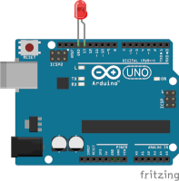
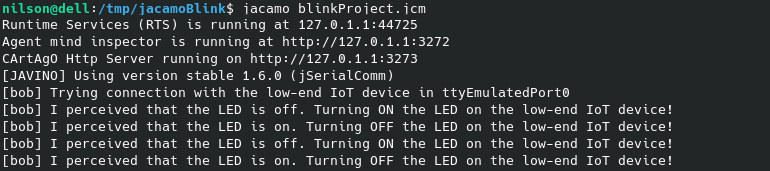
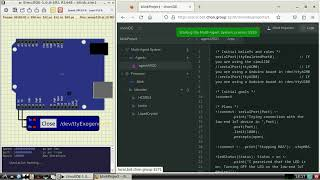

# Javino Blink Project


---
- Reasoning layer

    In this project the [agent](jacamo/src/agt/sample_agent.asl) turn an LED ON and OFF every reasoning circle.

    

- Interfacing layer
    
    The low-end IoT device provide the follow perceptions and support the actions below: 

    
    Percepts:
    ```
    ledStatus(on|off)               //the LED status
    ```

    Actions:
    ```
    ledOn                           //turn ON  the LED
    ledOff                          //turn OFF the LED
    ```
- Firmware layer
    - [Project using Arduino](Blink.ino)

- Hardware Layer
    - [Schematic Project](Blink.fzz) using Fritzing.
    - [Simulation Project](Blink.sim1) using SimulIDE.

---
### Demonstration
[](https://youtu.be/WbX-HOahMkc)